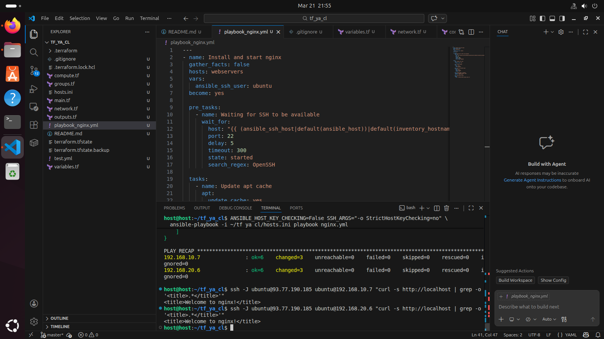

# Задание 1

## Yandex Cloud Infrastructure with Terraform + Ansible

Поднятие облачной инфраструктуры в Yandex Cloud:
- Bastion-хост с внешним IP (jump host)
- web-1 (zone A) и web-2 (zone B) без внешних IP
- NAT Gateway для исходящего интернета
- Security Groups

## Подготовка

### 1. Установка Terraform

Скачать дистрибутив со [страницы релизов](https://hashicorp-releases.yandexcloud.net/terraform/1.14.7/) (linux amd64.zip):

```bash
cd /tmp
wget https://hashicorp-releases.yandexcloud.net/terraform/1.14.7/terraform_1.14.7_linux_amd64.zip
unzip terraform_1.14.7_linux_amd64.zip
sudo mv terraform /usr/bin/terraform
terraform --version
```

### 2. Настройка зеркала провайдеров

```bash
nano ~/.terraformrc
```

```hcl
provider_installation {
  network_mirror {
    url     = "https://terraform-mirror.yandexcloud.net/"
    include = ["registry.terraform.io/*/*"]
  }
  direct {
    exclude = ["registry.terraform.io/*/*"]
  }
}
```

### 3. Установка Yandex Cloud CLI

Следовать [официальной инструкции](https://yandex.cloud/ru/docs/tutorials/infrastructure-management/terraform-quickstart#cli_1):

```bash
curl -sSL https://storage.yandexcloud.net/yandexcloud-yc/install.sh | bash
yc init
```

### 4. SSH-ключ

```bash
ssh-keygen -t ed25519 -C "terraform-yc"
```

---

## Структура проекта

```
tf_ya_cl/
├── main.tf             # провайдер Yandex Cloud
├── variables.tf        # переменные (cloud_id, folder_id, ресурсы ВМ)
├── network.tf          # VPC, подсети, NAT Gateway, route table
├── security_groups.tf  # firewall rules
├── compute.tf          # bastion, web-1, web-2
├── outputs.tf          # вывод IP-адресов и SSH-команд
├── hosts.ini           # инвентарь Ansible
├── test.yml            # тестовый Ansible playbook
└── README.md
```

---

## Развёртывание

### 5. Инициализация проекта

```bash
cd ~/tf_ya_cl
touch variables.tf network.tf compute.tf outputs.tf security_groups.tf
```

Заполнить файлы (см. исходники в репозитории).

В `variables.tf` вписать свои значения `cloud_id` и `folder_id`.

Узнать свой внешний IP для `admin_ip`:

```bash
curl ifconfig.me
```

### 6. Запуск Terraform

```bash
terraform init
terraform validate
terraform plan
terraform apply
```

После `apply` в выводе появятся IP-адреса:

```
bastion_external_ip = "x.x.x.x"
web1_internal_ip    = "192.168.10.x"
web2_internal_ip    = "192.168.20.x"
```

---

## Подключение по SSH

Через jump host вручную:

```bash
ssh ubuntu@<bastion_external_ip>
ssh -J ubuntu@<bastion_external_ip> ubuntu@192.168.10.x
ssh -J ubuntu@<bastion_external_ip> ubuntu@192.168.20.x
```

Или через `~/.ssh/config`:

```
Host <bastion_external_ip>
    User ubuntu

Host 192.168.10.*
    ProxyJump <bastion_external_ip>
    User ubuntu

Host 192.168.20.*
    ProxyJump <bastion_external_ip>
    User ubuntu

Host *.ru-central1.internal
    ProxyJump <bastion_external_ip>
    User ubuntu
```

---

## Ansible

Создать `hosts.ini` с IP-адресами из вывода Terraform:

```ini
[bastion]
<bastion_external_ip> ansible_user=ubuntu

[webservers]
192.168.10.x ansible_user=ubuntu ansible_ssh_common_args='-o StrictHostKeyChecking=no -o ProxyJump=ubuntu@<bastion_external_ip>'
192.168.20.x ansible_user=ubuntu ansible_ssh_common_args='-o StrictHostKeyChecking=no -o ProxyJump=ubuntu@<bastion_external_ip>'
```

Запуск playbook:

```bash
rm ~/.ssh/known_hosts
ANSIBLE_HOST_KEY_CHECKING=False SSH_ARGS="-o StrictHostKeyChecking=no" \
  ansible-playbook -i ~/tf_ya_cl/hosts.ini test.yml
```

---

## Удаление инфраструктуры

```bash
terraform destroy
```

# Задание 2 — Установка nginx через Ansible

Playbook `nginx.yml` устанавливает и запускает nginx на web-1 и web-2.

Запуск:
```bash
ANSIBLE_HOST_KEY_CHECKING=False SSH_ARGS="-o StrictHostKeyChecking=no" \
  ansible-playbook -i ~/tf_ya_cl/hosts.ini nginx.yml
```


